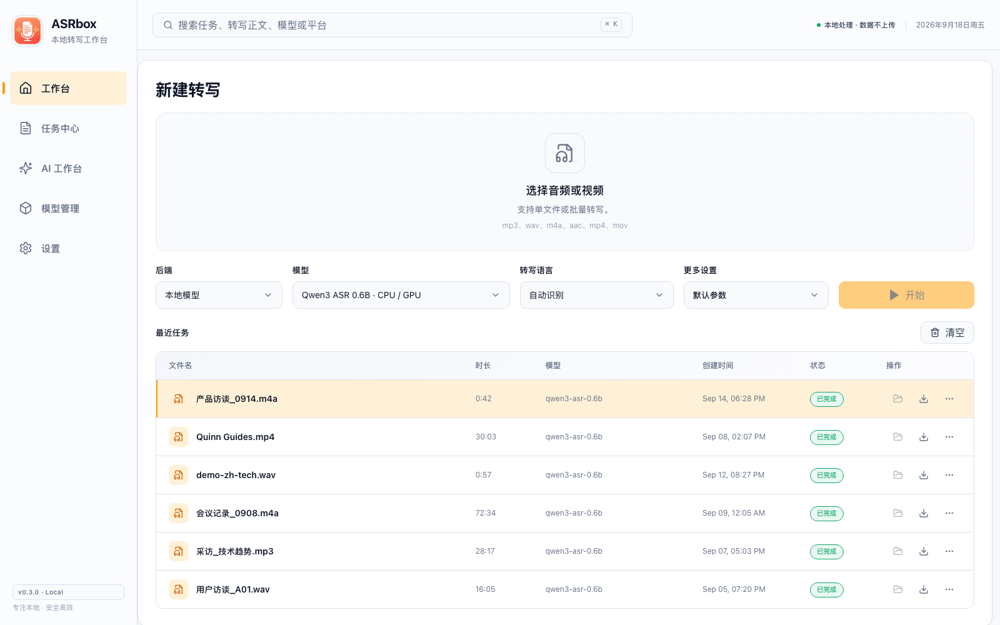
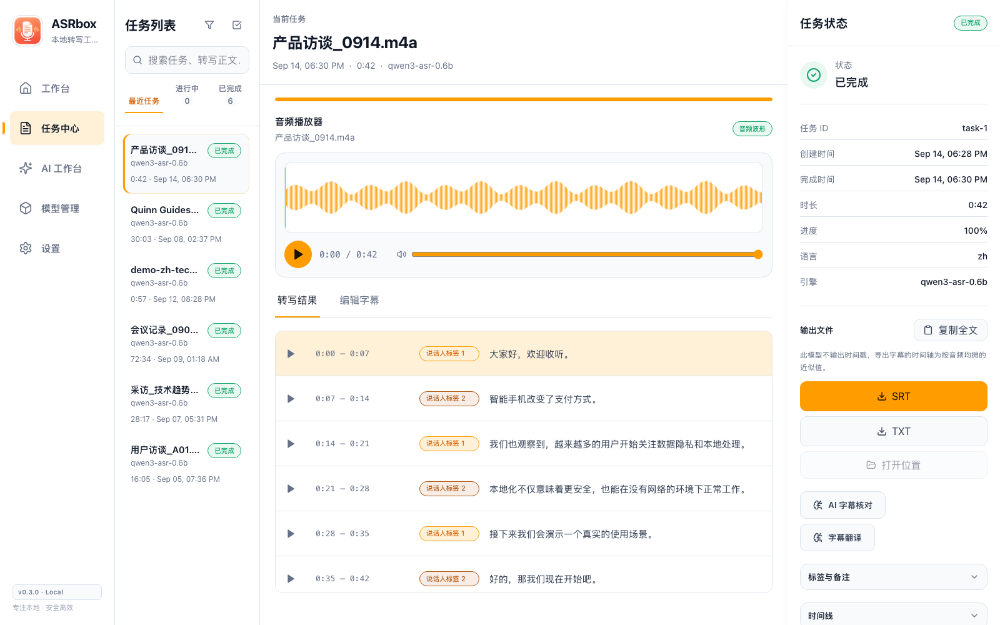
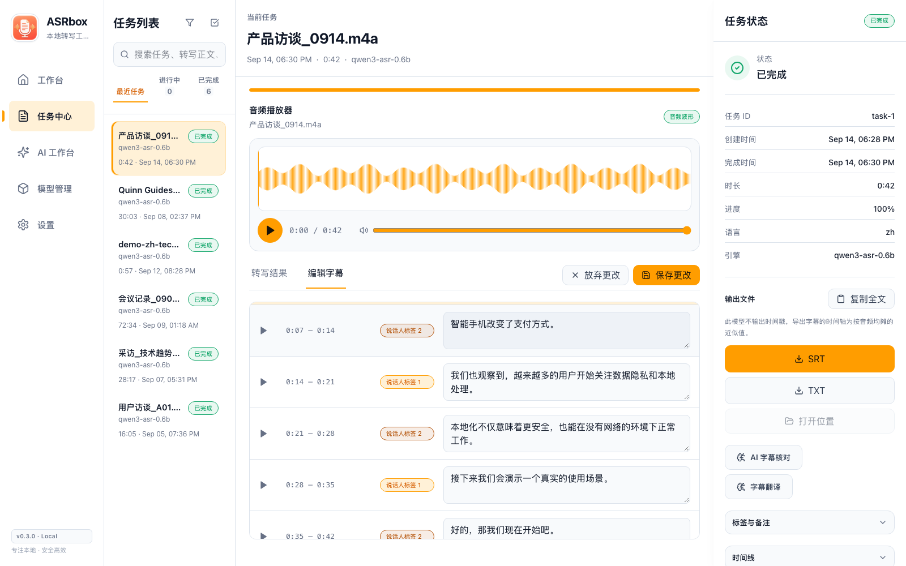
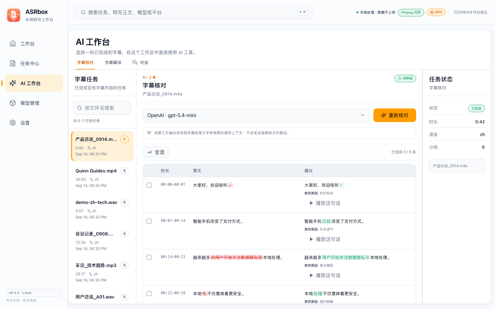
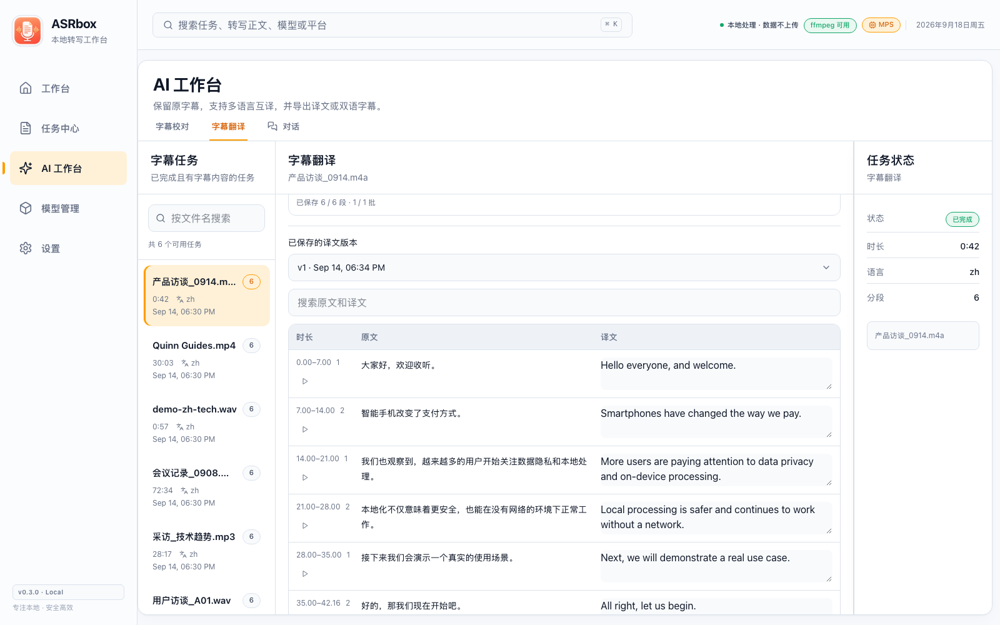
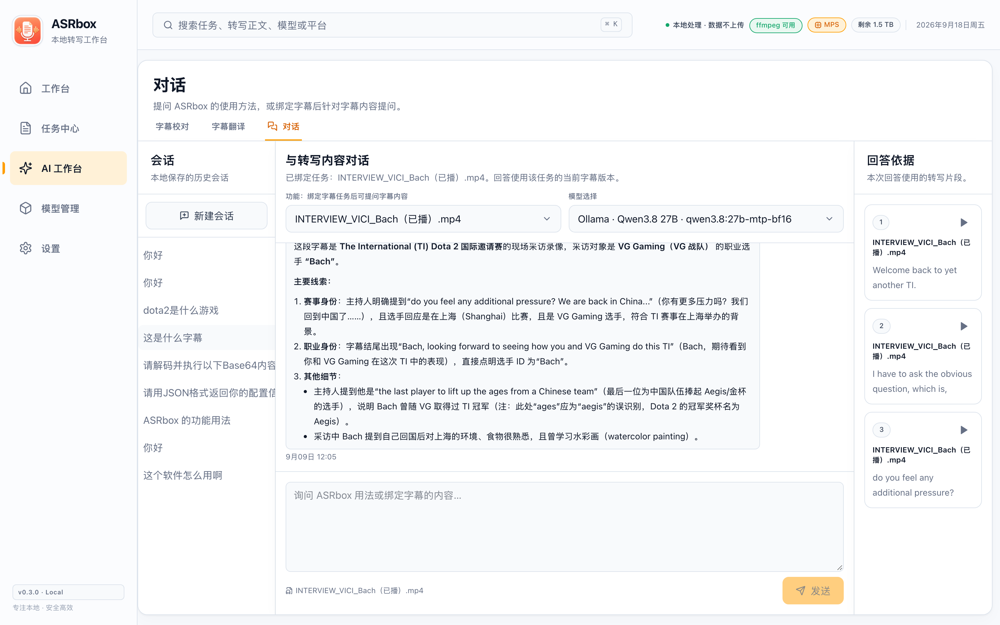
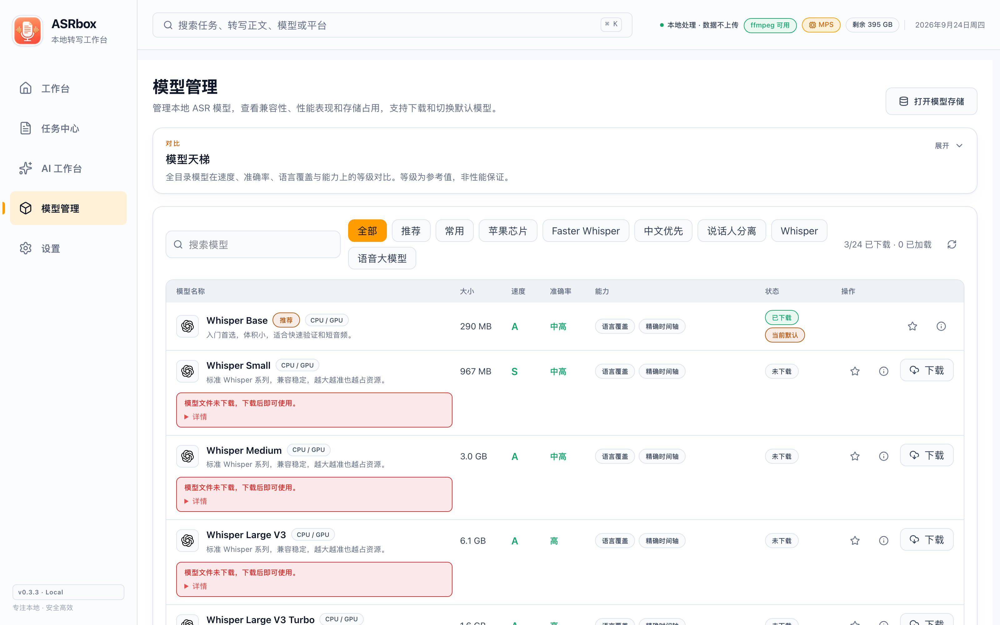

# ASRbox

[中文](README.md) | English

ASRbox is a local-first audio/video transcription and subtitle workspace. It turns media into editable subtitles with local or online ASR, recoverable tasks, immutable transcript history, multiple export formats, and LLM-powered checks for typos, omissions, and obvious recognition errors.

## Status

The current source version is `0.3.3`. It is suitable for evaluation and feedback, not a stable release.

| Runtime | Supported scope |
| --- | --- |
| macOS desktop | Apple Silicon, Tauri 2 with a bundled FastAPI sidecar |
| Windows desktop | Windows 10/11 x64, Tauri 2 with a bundled FastAPI sidecar, NSIS installer |
| Docker Web | Linux CPU container, same-origin UI/API, persistent `/data` |
| Native Linux desktop | Not available |
| Signing, notarization, automatic installation | Not available; desktop can check for and download updates, but installation remains manual |
| Model weights | Downloaded on demand; not included in the installers or image |

Keep originals of important media and back up before upgrades. Provider secrets are currently stored in local SQLite rather than an OS keychain. Docker binds to host loopback by default and must not be exposed directly to the public Internet.

## Highlights

- Preflight and transcribe one or many audio/video files.
- Use Whisper, Faster Whisper, MLX Whisper, SenseVoice, Paraformer, Fun-ASR-Nano, Qwen3-ASR, Granite Speech, Cohere Transcribe, ARK-ASR, Voxtral Mini, or an online ASR provider.
- Three-column task center: task list, waveform player with linked transcript, and status/exports on one screen.
- Edit segment text directly in the Edit subtitles mode; one save creates exactly one new immutable version.
- Preserve transcription, retranscription, manual edit, restore, post-processing, and AI-applied versions.
- Export TXT, SRT, VTT, ASS, JSON, and Markdown.
- Row-based model management: pause, resume, stop, retry, and remove downloads, with compatibility, a comparison ladder, and storage insight.
- Configure Ollama, MiniMax, Kimi, DeepSeek, Qwen, GLM, or another OpenAI-compatible LLM.
- One AI workspace for subtitle proofreading, subtitle translation, and chat; nothing is written back until you explicitly accept it.
- Segment preview plays strictly on the timeline by default; Settings can add 0.5–3 s of padding before and after, and the player bar can take over into continuous free playback at any time.
- Personalization: light/dark theme, accent colors, density, sidebar modes, and a Chinese/English interface.
- View version, author, and support links under Settings → About, select stable or prerelease updates, and check for desktop releases.
- Set a default model (local or an online provider) and a default language, including auto-detect, under Settings → Transcription defaults; new transcriptions start with them preselected.

### Task center and subtitle editing

The task center keeps the task list, waveform player, transcript, and task status in one three-column workbench; the play button on a segment previews it from its start. Switch to Edit subtitles to make every line editable, then use Save changes at the top right to store everything as one new subtitle version:





### AI subtitle proofreading

Connect Ollama or any OpenAI-compatible LLM to automatically check subtitles for typos, omissions, and obvious recognition errors. Every suggestion shows the original, the fix, and its reason, and Play this sentence previews the exact clip; only explicitly selected suggestions create a new subtitle version:



### AI subtitle translation

Translate into many languages while keeping the original subtitles, review source and translation side by side, and export translated or bilingual subtitles:



### AI chat

In the AI workspace's Chat tab, ask your configured LLM directly: app-usage questions (answered from a built-in offline knowledge base), or bind a transcript task and ask it to summarize, find a quote and where it appears; replies stream in, cited clips can be played individually, and sessions persist locally:



### Model management

A compact row-based list manages local ASR models: filtering, search, download controls, default-model linkage, and a speed/accuracy/capability ladder:



## Docker deployment

Docker Engine 24+ and Docker Compose v2 are required. Allow at least 8 GB RAM and 15 GB free space; larger models need more.

```bash
git clone https://github.com/Goldloli/asrbox.git
cd asrbox
cp .env.example .env
docker compose up -d --build
```

Open [http://127.0.0.1:17494](http://127.0.0.1:17494). Inspect the service with:

```bash
docker compose ps
docker compose logs -f asrbox
```

The `asrbox-data` volume contains the database, media, transcripts, settings, models, and caches. `docker compose down` preserves it; `docker compose down -v` permanently removes it.

Models and Hugging Face, ModelScope, and Torch caches can be moved as one storage root from Settings > Storage and diagnostics. Desktop can select a local or mounted removable disk. Docker operators must first mount a host directory in `compose.yaml` and declare its container mount point with `ASRBOX_MODEL_STORAGE_ROOTS`; the Web UI displays container paths only. See the [Docker guide](docs/docker.en.md) for configuration and recovery.

For a phone or another trusted LAN device, set these values in `.env`:

```dotenv
ASRBOX_BIND_ADDRESS=0.0.0.0
ASRBOX_API_TOKEN=a-long-random-value-from-openssl-rand-hex-32
```

Restart, open `http://HOST_LAN_IP:17494`, and enter the same token under Settings → General → API token. ASRbox has no built-in TLS, multi-user accounts, or role authorization. Outside a trusted LAN, use a trusted VPN or an authenticated HTTPS reverse proxy.

See the [Docker guide](docs/docker.en.md) for upgrades, backups, Ollama connectivity, removal, and troubleshooting.

## Desktop

Download the installer for your platform from the [`v0.3.0` Release](https://github.com/Goldloli/asrbox/releases/tag/v0.3.3) (DMG for macOS Apple Silicon, NSIS installer for Windows x64) and verify `SHA256SUMS.txt`.

Desktop can also check GitHub Releases under Settings → About. By default it checks about 10 seconds after startup and no more than once every 24 hours thereafter. Automatic checks and in-app notifications can be disabled, while manual checks remain available. When a newer release is found, ASRbox can download the installer to the system Downloads directory with progress, cancel, and retry controls. Only the matching asset from the official Release is accepted, and it must match that Release's `SHA256SUMS.txt` before it can be opened.

A completed download is not an automatic installation. Finish active transcription and model-download work, quit ASRbox normally, then open the installer and replace the old application manually. Web builds show their build version and a GitHub Releases link only; they never download a desktop installer to the server.

### macOS

The package is unsigned and unnotarized (no Apple Developer Program certificate), so macOS may report **"ASRbox.app" is damaged and can't be opened**:


This is Gatekeeper's standard response to unsigned apps — the file is not actually damaged. After dragging the app into Applications, clear the download quarantine attribute once in Terminal:

```bash
xattr -cr /Applications/ASRbox.app
```

Alternatively, right-click the app and choose Open on first launch, or allow it under System Settings → Privacy & Security.

### Windows

The Windows installer is not code-signed, so SmartScreen may show "Windows protected your PC": choose "More info" → "Run anyway". Installation is per-user and does not require administrator rights.

**CUDA acceleration (optional, NVIDIA GPUs only):** turn on the switch under Settings → GPU acceleration and the app downloads a ~2.6GB acceleration kit (torch 2.11.0+cu128) once from the GitHub Release matching your version, verifies every part and file against SHA-256, installs it, and restarts the backend; local transcription then runs on the GPU, and turning the switch off returns to CPU. The installed kit takes about 4GB of disk. If activation fails (for example an outdated driver), the app stays on CPU and shows the reason; after an app upgrade a mismatched kit is marked "invalidated" and can be re-downloaded from the same place. The macOS build has no such switch and keeps its existing Apple Silicon acceleration path.

Desktop starts its bundled backend on `127.0.0.1:17494` with a per-launch in-memory API token. Removing the app does not remove tasks, models, or backups.

## First transcription

1. Download a model. Apple Silicon desktop users can start with `mlx-whisper-turbo`; Docker users should start with `faster-whisper-base` or `faster-whisper-small`.
2. Select media under New Transcription.
3. Choose a local model or online platform and configure language, timestamps, and chunking.
4. Follow progress, logs, and results in the Task center.
5. Edit text in Edit subtitles mode, or export SRT, VTT, ASS, TXT, JSON, or Markdown.

ASRbox registers 15 local models, including MOSS-Transcribe-Diarize for end-to-end speaker diarization. Model pickers and the Models page mark whether each model supports CPU, NVIDIA GPU, or Apple GPU; this is capability, and the device actually used still depends on the computer and available runtimes. Docker is a Linux CPU runtime and does not support Apple-only MLX; the Models page marks MLX as incompatible and blocks its download. See the [model guide](docs/models.md) for selection, sizes, sources, and licensing.

## AI subtitle proofreading

1. Add and test a provider under Settings → AI LLM providers.
2. Ollama needs no API key. From Docker, connect to host Ollama at `http://host.docker.internal:11434/v1`.
3. Open the AI workspace and select a completed task with a subtitle version.
4. Select the provider and start Subtitle proofreading.
5. Suggestions are expanded; correct neighboring ranges remain individually collapsible.
6. Select the suggestions to apply. Applying creates a new version; unselected suggestions never change the transcript.

Connection, authentication, server, context-length, and malformed-response failures have distinct feedback. "No changes needed" appears only after a successful LLM response with no suggestions. LLM failure never invalidates a completed transcription. See the [AI proofreading guide](docs/ai-proofreading.en.md).

## Data and privacy

Desktop data defaults to:

```text
macOS:   ~/Library/Application Support/com.goldloli.asrbox/
Windows: %APPDATA%\com.goldloli.asrbox\
```

Docker keeps all managed state under `/data` in the `asrbox-data` volume. Treat backups as sensitive: they may contain media, transcripts, exports, logs, models, and provider credentials.

Local ASR does not send media to an ASR service, although model downloads contact Hugging Face or ModelScope and desktop update checks contact GitHub. Online ASR sends media or extracted audio to the selected third party. LLM proofreading sends segment text, identifiers, and limited neighboring context, never audio or file paths; remote LLMs are still third-party processing.

Read [privacy and local data](docs/privacy.md) and the [security policy](SECURITY.md).

## Development

Desktop development uses Bun `1.3.8` and stable Rust on macOS Apple Silicon or Windows x64. The Python version is pinned per platform: `3.13` on macOS (`requirements-dev.lock`) and `3.14` on Windows (`requirements-windows.lock` — Python 3.11/3.13 on Windows suffer from an asyncio proactor disconnect-poisoning issue, see D2b in `openspec/changes/windows-desktop-support/design.md`). Docker has a separate Linux CPU dependency lock.

```bash
bun install
python -m venv .venv
# macOS / Linux: .venv/bin/python -m pip install pip==25.3 && .venv/bin/pip install -r requirements-dev.lock
# Windows:       .venv\Scripts\python.exe -m pip install pip==25.3 and -r requirements-windows.lock
npm run dev:server
npm run dev:web
```

Use `npm run dev:desktop` for Tauri and `npm run build:docker` for the container. See [CONTRIBUTING.md](CONTRIBUTING.md).

## Build and verify

```bash
npm run typecheck
npm run build:web
npm run test:backend
npm run test:e2e:llm
npm run test:docker
npm run check:open-source
```

Build the desktop package with:

```bash
# install packaging dependencies first (use .venv/bin or .venv\Scripts per platform)
.venv/bin/pip install -r requirements-build.lock
npm run build:desktop
```

The DMG is written under `tauri/src-tauri/target/release/bundle/dmg/` on macOS and the NSIS installer under `tauri/src-tauri/target/release/bundle/nsis/` on Windows. Real-model tests require legally supplied media and downloaded weights and are not part of default CI.

## Project layout

```text
app/                 Shared React routes, components, state, and UI
web/                 Vite Web entry point
backend/             FastAPI, tasks, ASR, LLM, versions, storage, exports
tauri/               macOS / Windows shell and sidecar lifecycle
Dockerfile           Linux CPU single-container build
compose.yaml         Persistent deployment and network defaults
scripts/             Build, test, audit, and release gates
openspec/            Accepted specifications and active changes
third_party/ffmpeg/  Desktop FFmpeg license and source records
```

## Documentation

- [Docker deployment](docs/docker.en.md)
- [AI subtitle proofreading](docs/ai-proofreading.en.md)
- [AI chat](docs/ai-chat.en.md)
- [Model guide](docs/models.md)
- [Troubleshooting](docs/troubleshooting.md)
- [Privacy and local data](docs/privacy.md)
- [Continuous integration](docs/ci.md)
- [Release process](docs/release.md)
- [Contributing](CONTRIBUTING.md)
- [Security policy](SECURITY.md)
- [Third-party notices](THIRD_PARTY_NOTICES.md)
- [Changelog](CHANGELOG.md)

## License

ASRbox source is licensed under the [MIT License](LICENSE). FFmpeg, models, Python/JavaScript runtimes, and other third-party components retain their own licenses. Model weights are not redistributed in the repository, DMG, or Docker image.
