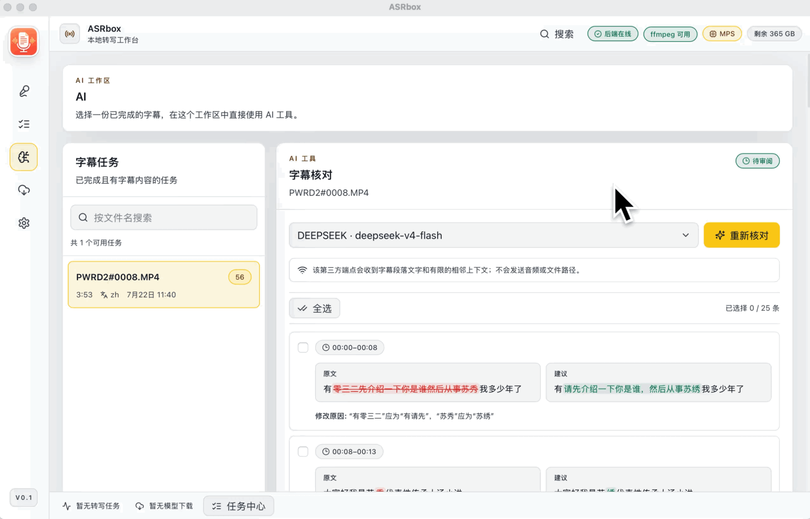
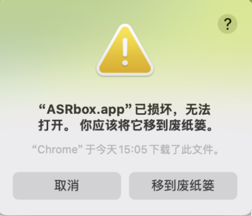

# ASRbox

中文 | [English](README.en.md)

ASRbox 是一个本地优先的音视频转写与字幕工作台。它把媒体转换为可编辑字幕，支持本地与在线 ASR、任务恢复、版本历史、多格式导出，并可让 Ollama 或 OpenAI 兼容 LLM 核对字幕中的错字、漏字和明显识别错误。

## 当前状态

当前源码版本为 `0.1.2-rc.2`，适合试用和反馈，还不是稳定版。

| 运行方式 | 支持范围 |
| --- | --- |
| macOS 桌面端 | Apple Silicon，Tauri 2 + 内置 FastAPI sidecar |
| Docker Web | Linux CPU 容器，网页与 API 同源，数据持久化到 `/data` |
| Windows / Linux 原生桌面端 | 暂未提供 |
| 签名、公证、自动更新 | 暂未提供 |
| 模型权重 | 按需下载，不包含在 DMG 或 Docker 镜像中 |

重要素材请保留原件，升级前先备份。Provider 密钥目前保存在本地 SQLite 数据库中，未接入系统钥匙串。Docker 默认只允许本机访问，不应直接暴露到公网。

## 主要功能

- 拖入单个或多个音频、视频，预检音轨、格式、时长和分段策略。
- 使用 Whisper、Faster Whisper、MLX Whisper、SenseVoice、Qwen3-ASR，或在线 ASR Provider 转写。
- 暂停、继续、停止、重试和删除模型下载，查看运行时兼容性与磁盘占用。
- 查看、搜索、替换、编辑、播放和复制转写结果。
- 保留转写、重新转写、手工编辑、恢复、后处理和 AI 修改形成的不可变版本。
- 导出 TXT、SRT、VTT、ASS、JSON 和 Markdown。
- 配置 Ollama、MiniMax、Kimi、DeepSeek、Qwen、GLM 或其他 OpenAI 兼容 LLM。
- 在独立的“AI → 字幕核对”工作区审阅建议，明确勾选后才生成新字幕版本。

### LLM 核验校对

接入 Ollama 或任意 OpenAI 兼容 LLM，自动核对转写字幕中的错字、漏字和明显识别错误，并给出可直接套用的修改建议：



## Docker 部署

需要 Docker Engine 24+ 和 Docker Compose v2。建议至少准备 8 GB 内存和 15 GB 可用空间；大模型还需要更多空间与内存。

```bash
git clone https://github.com/Goldloli/asrbox.git
cd asrbox
cp .env.example .env
docker compose up -d --build
```

浏览器打开 [http://127.0.0.1:17494](http://127.0.0.1:17494)。查看状态和日志：

```bash
docker compose ps
docker compose logs -f asrbox
```

数据库、媒体、字幕、设置、模型和缓存都在名为 `asrbox-data` 的 Docker volume 中。`docker compose down` 不会删除它；`docker compose down -v` 会永久删除数据。

模型与 Hugging Face、ModelScope、Torch 缓存可在“设置 → 存储与诊断”中迁移到统一存储根。桌面版可选择本地或已挂载外接磁盘；Docker 版必须先在 `compose.yaml` 中挂载宿主机目录并通过 `ASRBOX_MODEL_STORAGE_ROOTS` 声明允许的容器挂载点，Web 页面只显示容器路径。完整配置与恢复步骤见 [Docker 部署指南](docs/docker.md)。

默认配置只绑定 `127.0.0.1`。手机或其他局域网设备访问时，在 `.env` 中设置：

```dotenv
ASRBOX_BIND_ADDRESS=0.0.0.0
ASRBOX_API_TOKEN=使用-openssl-rand-hex-32-生成的长随机值
```

重启后用 `http://主机局域网IP:17494` 打开，在“设置 → 通用 → API 令牌”输入同一令牌。ASRbox 没有内置 TLS、多用户账号或权限系统；局域网以外请使用可信 VPN，或带 HTTPS 和认证的反向代理。

完整升级、备份、Ollama 连接、卸载和排障步骤见 [Docker 部署指南](docs/docker.md)。

## macOS 桌面端

从 [`v0.1.2-rc.2` Release](https://github.com/Goldloli/asrbox/releases/tag/v0.1.2-rc.2) 下载 Apple Silicon DMG，并校验 `SHA256SUMS.txt`。

当前包未签名、未公证（未购买 Apple Developer Program 证书），macOS 可能直接提示 **“ASRbox.app”已损坏，无法打开**：



这是 Gatekeeper 对未签名应用的常见提示，并非文件真的损坏。把应用拖入“应用程序”后，在终端执行一次以下命令，清除下载文件的隔离属性即可正常打开：

```bash
xattr -cr /Applications/ASRbox.app
```

也可以在首次打开时右键应用选择“打开”，或在“系统设置 → 隐私与安全性”中允许打开。

桌面端在 `127.0.0.1:17494` 启动内置后端，每次启动生成仅在内存中的 API token；退出应用会停止 sidecar。删除应用不会删除任务、模型或备份。

## 第一次转写

1. 在“模型”页下载模型。桌面 Apple Silicon 可先试 `mlx-whisper-turbo`；Docker 建议先试 `faster-whisper-base` 或 `faster-whisper-small`。
2. 在“新建转写”选择音频或视频。
3. 选择本地模型或在线平台，设置语言、时间戳和分段选项。
4. 提交后在“任务”查看进度、日志和转写结果。
5. 编辑字幕或导出 SRT、VTT、ASS、TXT、JSON、Markdown。

ASRbox 注册 15 个本地模型，其中包括端到端说话人分离模型 MOSS-Transcribe-Diarize。Docker 是 Linux CPU 运行时，不支持 Apple 专用的 MLX；模型页面会把 MLX 标为不兼容并阻止下载。模型选择、体积、来源和许可说明见[模型指南](docs/models.md)。

## AI 字幕核对

1. 打开“设置 → AI LLM 提供商”，新增并测试一个提供商。
2. Ollama 不需要接口密钥；Docker 连接宿主机 Ollama 时使用 `http://host.docker.internal:11434/v1`。
3. 打开左侧“AI”，选择一个已完成且有字幕版本的任务。
4. 选择提供商并开始“字幕核对”。
5. 页面默认只展开 LLM 发现的建议；正确段落按相邻区间分别折叠，可逐段展开。
6. 勾选要采纳的建议后点击应用。未勾选的建议不会改字幕，应用结果会创建新版本。

连接失败、鉴权失败、服务端错误、上下文过长和返回格式错误会分别提示；只有 LLM 正常完成且没有建议时，才显示“没有发现需要修改的内容”。LLM 失败不会影响已经成功的转写。详见 [AI 字幕核对指南](docs/ai-proofreading.md)。

## 数据与隐私

桌面数据默认位于：

```text
~/Library/Application Support/com.goldloli.asrbox/
```

Docker 数据统一位于容器 `/data`，由 `asrbox-data` volume 持久化。这里可能包含原始媒体、提取音频、字幕版本、导出、模型、日志和 Provider 密钥，备份时应按敏感数据处理。

本地 ASR 不会把媒体发送给 ASR 服务，但下载模型仍会访问 Hugging Face 或 ModelScope。在线 ASR 会把媒体或音频发送给所选第三方。LLM 核对只发送字幕段落文字、段落编号和有限相邻上下文，不发送音频或文件路径；远程 LLM 仍属于第三方处理。

详见[隐私与本地数据](docs/privacy.md)和[安全政策](SECURITY.md)。

## 本地开发

桌面开发目标使用 Bun `1.3.8`、Python `3.13`、Rust stable 和 macOS Apple Silicon；Docker 运行时使用独立的 Linux CPU 依赖锁。

```bash
bun install
python -m venv .venv
.venv/bin/python -m pip install pip==25.3
.venv/bin/pip install -r requirements-dev.lock
npm run dev:server
npm run dev:web
```

桌面开发：`npm run dev:desktop`。容器构建：`npm run build:docker`。详细贡献流程见 [CONTRIBUTING.md](CONTRIBUTING.md)。

## 构建与验证

```bash
npm run typecheck
npm run build:web
npm run test:backend
npm run test:e2e:llm
npm run test:docker
npm run check:open-source
```

桌面安装包：

```bash
.venv/bin/pip install -r requirements-build.lock
npm run build:desktop
```

输出位于 `tauri/src-tauri/target/release/bundle/dmg/`。真实模型测试需要自行准备合法媒体和已下载模型，不属于默认 CI。

## 项目结构

```text
app/                 React 路由、组件、状态和共享 UI
web/                 Vite Web 入口
backend/             FastAPI、任务、ASR、LLM、版本、存储和导出
tauri/               macOS 桌面壳与 sidecar 生命周期
Dockerfile           Linux CPU 单容器构建
compose.yaml         持久化和网络部署入口
scripts/             构建、测试、审计和发布门禁
openspec/            已接受规格与活动变更
third_party/ffmpeg/  桌面内置 FFmpeg 的许可与来源材料
```

## 文档

- [Docker 部署](docs/docker.md)
- [AI 字幕核对](docs/ai-proofreading.md)
- [模型指南](docs/models.md)
- [故障排查](docs/troubleshooting.md)
- [隐私与本地数据](docs/privacy.md)
- [持续集成](docs/ci.md)
- [发布流程](docs/release.md)
- [贡献指南](CONTRIBUTING.md)
- [安全政策](SECURITY.md)
- [第三方依赖与许可](THIRD_PARTY_NOTICES.md)
- [更新记录](CHANGELOG.md)

## 许可证

ASRbox 源代码采用 [MIT License](LICENSE)。FFmpeg、模型、Python/JavaScript 运行库和其他第三方组件分别受其自身许可证约束。模型权重不会随仓库、DMG 或 Docker 镜像分发。
