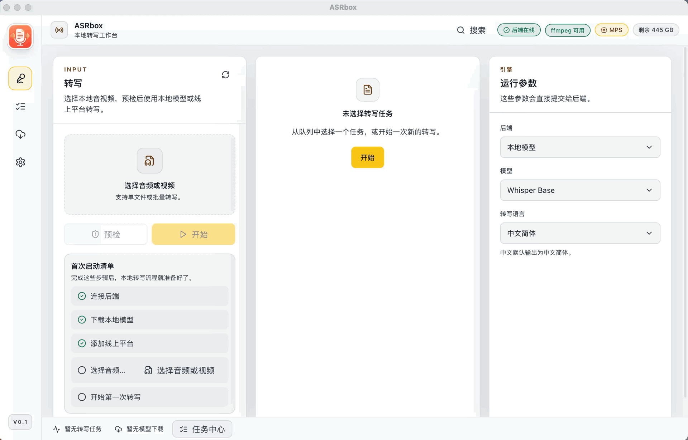

# ASRbox

中文 | [English](README.en.md)

ASRbox 是一个本地优先的音视频转写工作台。它提供 Web UI 和 macOS 桌面客户端，可以把音频、视频文件转成文本、字幕和结构化导出结果，支持本地 ASR 模型和在线 ASR 平台。

桌面端基于 Tauri 构建。用户打开应用后，ASRbox 会自动启动或复用本地后端，内置 ffmpeg / ffprobe 用于媒体预检和音频提取，并复用同一套 Web UI 作为主要交互界面。

## 功能特性

- 本地音频、视频转写工作流。
- 支持单文件选择、批量选择和拖拽上传。
- 预检媒体格式、音频流、时长和分段策略。
- 支持本地模型下载、运行状态和诊断信息。
- 支持配置在线 ASR 平台。
- 转写结果查看、搜索、替换、编辑、复制和音频播放。
- 支持 TXT、SRT、VTT、ASS、JSON、Markdown 导出。
- 桌面端可在设置中配置导出文件下载位置。
- 任务中心、历史任务、重试、重新转写、后处理、清理和清空任务列表。
- macOS 桌面包内置后端 sidecar 和 ffmpeg 工具。

## 项目状态

ASRbox 目前处于桌面 MVP 阶段。当前优先支持 macOS Apple Silicon 桌面包；Windows 和 Linux 会保留配置方向，但暂不作为第一阶段发布目标。

暂未包含：

- 代码签名和 macOS notarization。
- 自动更新。
- 系统托盘和后台常驻。
- Windows / Linux 发布产物。

## 架构

```text
ASRbox
|-- app/                 React 应用源码，Web 和桌面端复用
|-- web/                 Vite Web 入口和静态资源
|-- backend/             FastAPI 后端、ASR 调度、导出和存储
|-- tauri/               Tauri 桌面壳和 Rust sidecar 生命周期管理
|-- scripts/             后端二进制和开发 sidecar 构建脚本
|-- third_party/ffmpeg/  内置 ffmpeg / ffprobe 二进制和说明
`-- assets/              README 和项目展示资源
```

运行形态：

```text
Tauri 桌面端
  |-- 加载 Web UI
  |-- 在 127.0.0.1:17494 启动内置 asrbox-server
  |-- 注入内置 ffmpeg / ffprobe 路径
  `-- 将导出文件保存到用户配置的下载目录

Web UI
  `-- 连接已有后端地址，不自动启动本地后端
```

## 环境要求

- macOS Apple Silicon，用于当前桌面发布包。
- Bun 1.3.x。
- Python 3.11+，推荐使用项目 `.venv`。
- Rust stable 和 Tauri 构建工具链。
- 开发环境需要 ffmpeg / ffprobe，或使用 `third_party/ffmpeg/darwin-arm64/` 下的内置二进制。

安装前端依赖：

```bash
bun install
```

安装后端依赖：

```bash
python -m venv .venv
.venv/bin/pip install -r requirements.txt
```

## 本地开发

启动后端：

```bash
npm run dev:server
```

启动 Web UI：

```bash
npm run dev:web
```

启动桌面端开发模式：

```bash
npm run dev:desktop
```

桌面端开发模式会在需要时生成开发期 sidecar 占位文件。debug 构建优先使用 `.venv/bin/python -m backend.server` 启动后端，方便后端迭代时不必每次冻结二进制。

## 桌面端构建

构建 macOS `.app` 和 `.dmg`：

```bash
npm run build:desktop
```

构建流程会：

1. 使用 PyInstaller 冻结后端为 `asrbox-server` sidecar。
2. 复制当前平台的 ffmpeg / ffprobe 到 Tauri resources。
3. 在 `tauri/src-tauri/target/release/bundle/` 生成 `.app` 和 `.dmg`。

Apple Silicon 预期 DMG 路径：

```text
tauri/src-tauri/target/release/bundle/dmg/ASRbox_0.1.0_aarch64.dmg
```

## GitHub Releases

项目包含 MVP Release CI：

```text
.github/workflows/release.yml
```

触发方式：

- 推送 tag：

```bash
git tag v0.1.0
git push origin main --tags
```

- 或在 GitHub Actions 页面手动运行 `Release` workflow，并输入 tag，例如 `v0.1.0`。

当前 CI 会在 macOS runner 上构建 Apple Silicon DMG，生成 GitHub Release，并上传：

- `ASRbox_*.dmg`
- `SHA256SUMS.txt`

注意：当前发布包尚未签名和公证，macOS 首次打开时可能会提示无法验证开发者。这是未签名 MVP 包的正常现象。

## 测试

基础检查：

```bash
npm run typecheck
npm run build:web
```

后端测试：

```bash
npm run test:backend
npm run test:backend:contract
npm run test:backend:server
npm run test:backend:binary-smoke
```

Tauri 检查：

```bash
cd tauri/src-tauri
cargo check
cargo test
```

发布桌面产物前建议人工验证：

- 双击 `.app` 可以启动。
- 未手动启动后端时，桌面端会自动启动本地后端。
- 启动后 `http://127.0.0.1:17494/health` 返回 ASRbox 健康状态。
- 运行时诊断显示 ffmpeg 和 ffprobe 可用。
- MP4 预检成功。
- TXT / SRT / VTT / ASS / JSON / MD 可以导出到设置中的下载位置。
- 关闭桌面端后释放端口 `17494`。

## 配置

桌面端偏好会保存到 Web UI local storage 和 Tauri app data 目录。

常用位置：

- 后端数据：桌面端使用 Tauri app data 目录。
- 默认导出：`~/Downloads/ASRbox Exports`。
- 自定义导出：在 `设置 -> 通用 -> 下载位置` 中配置。
- 本地模型：后端数据目录下的 `models/`。
- 诊断和生成文件：后端数据目录。

后端环境变量：

- `ASRBOX_DATA_DIR`：后端数据根目录。
- `ASRBOX_FFMPEG_PATH`：显式指定 ffmpeg 路径。
- `ASRBOX_FFPROBE_PATH`：显式指定 ffprobe 路径。

## 常见问题

### 后端离线

- 桌面端可点击 `启动后端` 重试。
- 检查是否有其他进程占用 `17494` 端口。
- 如果上一次后端没有正常退出，可以重启应用。

### ffmpeg 缺失

- 桌面发布包会自动使用内置 ffmpeg / ffprobe。
- 开发环境可安装系统 ffmpeg，或使用 `third_party/ffmpeg/darwin-arm64/` 下的二进制。
- 可在 `设置 -> 存储与诊断` 查看检测到的工具路径和版本。

### 导出文件找不到

- 检查 `设置 -> 通用 -> 下载位置`。
- 如果没有设置自定义位置，ASRbox 会导出到 `~/Downloads/ASRbox Exports`。
- 如果目标文件已经存在，ASRbox 会自动追加数字后缀，不会覆盖旧文件。

### Qwen3-ASR 加载失败

Qwen3-ASR 依赖 Transformers 对应模型类支持。如果当前 Python 依赖中的 Transformers 不包含相关模块，后端会报告模型加载错误。请先更新后端依赖，再判断是否是前端问题。

## 贡献

建议保持改动小而可验证：

1. 先描述行为变化或创建 issue。
2. 后端行为尽量补测试。
3. 提交前运行 typecheck 和相关后端 / Tauri 检查。
4. 桌面打包改动尽量和 Web UI 重构分开。

## 许可证

ASRbox 使用 MIT License。详见 [LICENSE](LICENSE)。
